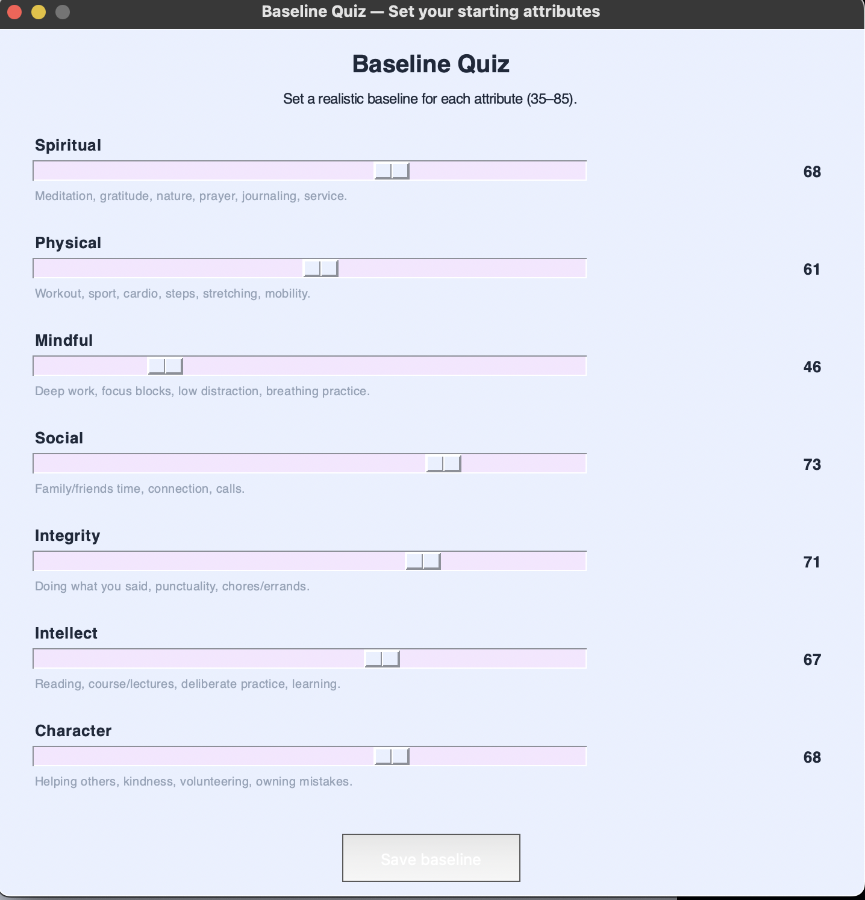
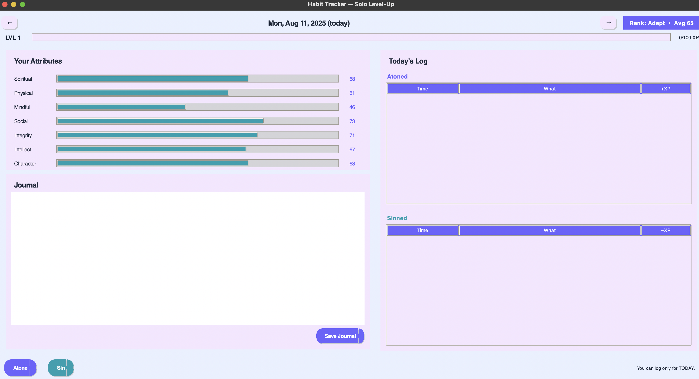
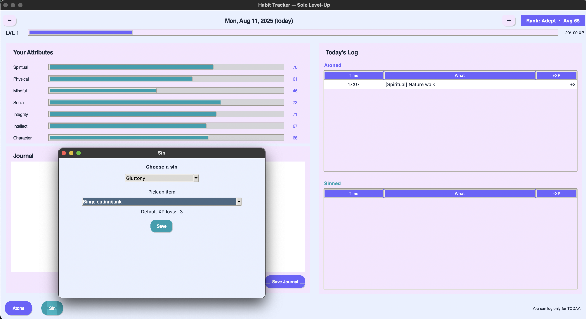

# SoloLeveller — A Gamified Habit Tracker

## Overview
SoloLeveller turns personal growth into an RPG-style progression loop inspired by Solo Leveling. You build seven core attributes through positive actions (“Atone”) and see them dip when you log negative behaviors (“Sin”). Daily play rewards consistency, variety, and honesty.

## Tech Stack
- Python — core logic  
- Tkinter — desktop UI  
- SQLite — local persistence  
- Pygame — SFX/BGM audio backend  
- Pillow (optional) — used for certain visual effects if enabled

## Current Feature Set (WIP)

### Attributes, Sins, and Logging
- Seven positive attributes: Spiritual, Physical, Mindful, Social, Integrity, Intellect, Character.
- Seven deadly sins mapped to the attribute they harm.
- Atoning/Sinning dialogs with curated menus plus an “Other…” option for custom entries.
- Today-only logging: you can only add or edit logs for the current day.
- Daily Double: each day highlights one Atone category and one Sin; matching entries are doubled in magnitude.

### Progression & Rank
- Attribute scale: FIFA-style 35–99 bounds with a sensible progression curve.
- XP strip and levels: total XP, level calculation, and progress to next level are shown; level-ups trigger a toast and SFX.

### Dates and History
- Start-day clamp: your viewable range is locked from the day you complete the baseline quiz up to today.  
  Example: if you started on Aug 13, you can view Aug 13…today and nothing outside that window.
- Daily journal with a writing prompt per day.
- Action log shows all entries for the selected date.

### Contracts (Pacts)
- My Contracts: your active, time-boxed commitments.
  - You can create one active personal contract at a time, lasting 1–7 days.
  - Global cap: maximum 3 active contracts total (personal + claimed).
  - Breaking a contract marks it broken and applies the XP penalty once (tracked).
- Available Today: rotating, time-limited contract offers you can claim before they expire (some expire in hours).
  - New offers are auto-generated daily.
  - A badge on the Contracts button shows how many offers are currently available.

### Themes, Audio, and UX
- Theme picker with multiple palettes; the whole UI restyles instantly.
- SFX and background music with a mute toggle (state persists).
- Baseline quiz on first run to establish starting stats.

## Screenshots (Work in Progress)




## Getting Started

### Install
```bash
git clone <repository-url>
cd habit-tracker
pip install -r requirements.txt
python main.py
```

### Resetting Data
If you want to reset all progress: rm habit_tracker.db


# License

Legends Never Fall by Aylex | https://freetouse.com/music/aylex
Free To Use | https://freetouse.com/music
Music promoted by https://www.free-stock-music.com

Winery by Aylex | https://freetouse.com/music/aylex
Free To Use | https://freetouse.com/music
Music promoted by https://www.free-stock-music.com

shadow/adult/shadow.png
	- Note: 
	- Licenses:
		- CC0
	- Authors:
		- drjamgo@hotmail.com
	- Links:
		- https://opengameart.org/content/shadow-for-lpc-sprite

body/bodies/male/taupe.png
	- Note: see details at https://opengameart.org/content/lpc-character-bases; 'Thick' Male Revised Run/Climb by JaidynReiman (based on ElizaWy's LPC Revised)
	- Licenses:
		- OGA-BY 3.0
		- CC-BY-SA 3.0
		- GPL 3.0
	- Authors:
		- bluecarrot16
		- JaidynReiman
		- Benjamin K. Smith (BenCreating)
		- Evert
		- Eliza Wyatt (ElizaWy)
		- TheraHedwig
		- MuffinElZangano
		- Durrani
		- Johannes Sjölund (wulax)
		- Stephen Challener (Redshrike)
	- Links:
		- https://opengameart.org/content/liberated-pixel-cup-lpc-base-assets-sprites-map-tiles
		- https://opengameart.org/content/lpc-medieval-fantasy-character-sprites
		- https://opengameart.org/content/lpc-male-jumping-animation-by-durrani
		- https://opengameart.org/content/lpc-runcycle-and-diagonal-walkcycle
		- https://opengameart.org/content/lpc-revised-character-basics
		- https://opengameart.org/content/lpc-be-seated
		- https://opengameart.org/content/lpc-runcycle-for-male-muscular-and-pregnant-character-bases-with-modular-heads
		- https://opengameart.org/content/lpc-jump-expanded
		- https://opengameart.org/content/lpc-character-bases

body/prosthesis/hook/male/mask/hook.png
	- Note: 
	- Licenses:
		- CC-BY-SA 3.0
	- Authors:
		- bluecarrot16
	- Links:
		- https://opengameart.org/content/lpc-pirates

body/prosthesis/hook/male/hook.png
	- Note: 
	- Licenses:
		- CC-BY-SA 3.0
	- Authors:
		- bluecarrot16
	- Links:
		- https://opengameart.org/content/lpc-pirates

head/heads/human/male/taupe.png
	- Note: original head by Redshrike, tweaks by BenCreating, modular version by bluecarrot16
	- Licenses:
		- OGA-BY 3.0
		- CC-BY-SA 3.0
		- GPL 3.0
	- Authors:
		- bluecarrot16
		- Benjamin K. Smith (BenCreating)
		- Stephen Challener (Redshrike)
	- Links:
		- https://opengameart.org/content/liberated-pixel-cup-lpc-base-assets-sprites-map-tiles
		- https://opengameart.org/content/lpc-character-bases

hair/spiked_porcupine/adult/ash.png
	- Note: 
	- Licenses:
		- CC-BY-SA 3.0
	- Authors:
		- Fabzy
		- bluecarrot16
	- Links:
		- https://opengameart.org/content/the-revolution-hair
		- https://opengameart.org/content/lpc-hair

torso/clothes/longsleeve/longsleeve/male/black.png
	- Note: original by wulax; tweaks and further recolors by bluecarrot16; cleanup and climb/jump/run/sit/emote/revised combat adapted from LPC Revised by JaidynReiman
	- Licenses:
		- OGA-BY 3.0
		- CC-BY-SA 3.0
		- GPL 3.0
	- Authors:
		- JaidynReiman
		- Johannes Sjölund (wulax)
	- Links:
		- https://opengameart.org/content/lpc-medieval-fantasy-character-sprites
		- http://opengameart.org/content/lpc-clothing-updates
		- https://opengameart.org/content/lpc-revised-character-basics
		- https://github.com/ElizaWy/LPC/tree/main/Characters/Clothing
		- https://opengameart.org/content/lpc-expanded-sit-run-jump-more
		- https://opengameart.org/content/lpc-expanded-simple-shirts

legs/pants2/male/gray.png
	- Note: original overalls by ElizaWy, base animations adapted from v3 overalls by bluecarrot16, pants by JaidynReiman
	- Licenses:
		- OGA-BY 3.0
		- GPL 3.0
	- Authors:
		- JaidynReiman
		- ElizaWy
		- Bluecarrot16
		- Johannes Sjölund (wulax)
		- Stephen Challener (Redshrike)
	- Links:
		- https://github.com/ElizaWy/LPC/tree/main/Characters/Clothing
		- https://opengameart.org/content/lpc-expanded-sit-run-jump-more
		- https://opengameart.org/content/lpc-expanded-pants

feet/shoes/revised/male/silver.png
	- Note: original overalls and shoes by ElizaWy, base animations adapted from v3 overalls by bluecarrot16, shoes by JaidynReiman
	- Licenses:
		- OGA-BY 3.0
		- GPL 3.0
	- Authors:
		- JaidynReiman
		- ElizaWy
		- Bluecarrot16
		- Stephen Challener (Redshrike)
		- Johannes Sjölund (wulax)
	- Links:
		- https://github.com/ElizaWy/LPC/tree/main/Characters/Clothing
		- https://opengameart.org/content/lpc-expanded-socks-shoes

Sound Effect by <a href="https://pixabay.com/users/u_vdwj1c20kz-50311970/?utm_source=link-attribution&utm_medium=referral&utm_campaign=music&utm_content=342335">u_vdwj1c20kz</a> from <a href="https://pixabay.com//?utm_source=link-attribution&utm_medium=referral&utm_campaign=music&utm_content=342335">Pixabay</a>
