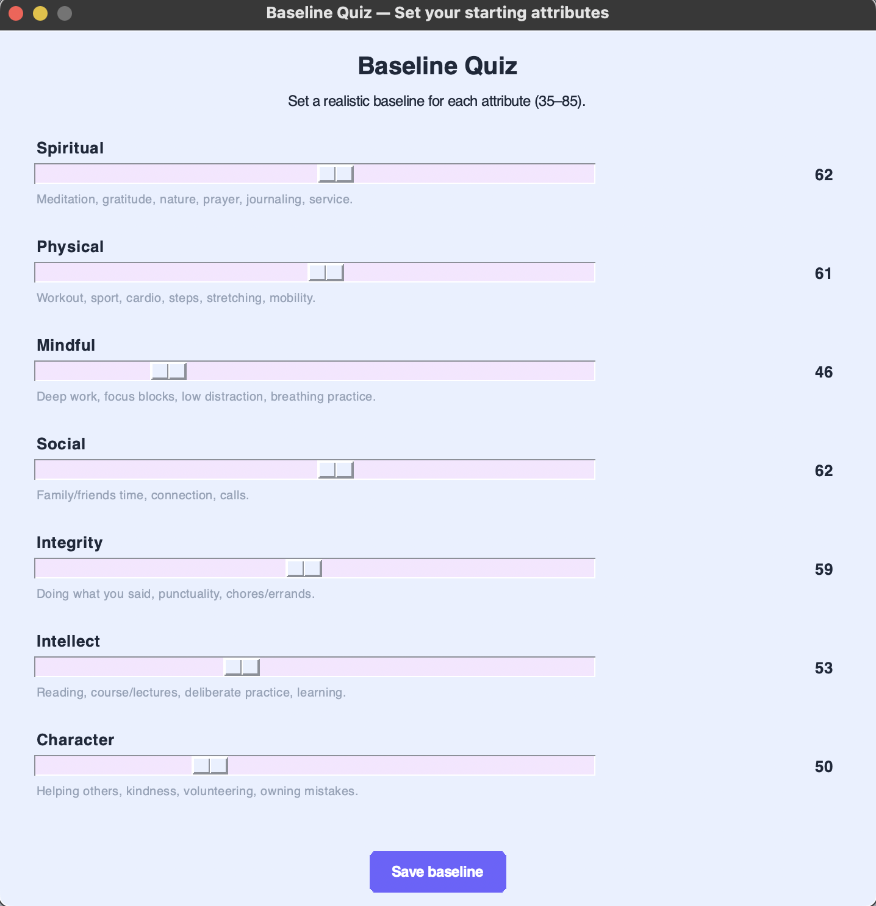
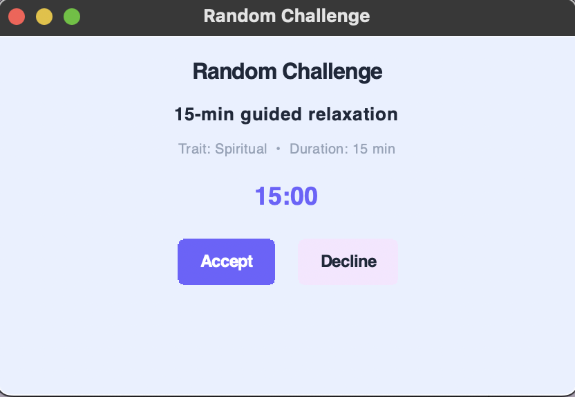
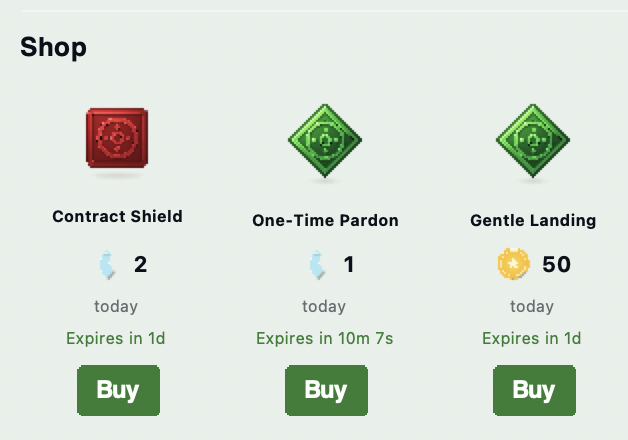
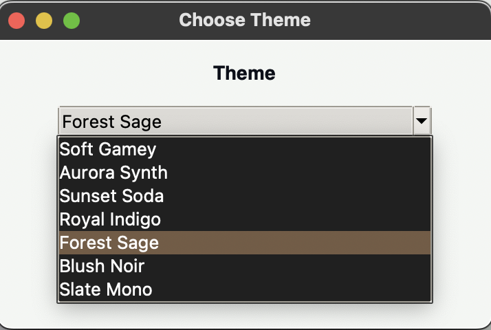
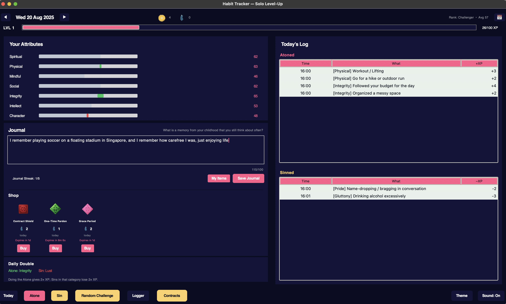

# SoloLeveller — A Gamified Habit Tracker

## Overview
SoloLeveller turns personal growth into an RPG-style progression loop inspired by Solo Leveling. You build seven core attributes through positive actions (“Atone”) and see them dip when you log negative behaviors (“Sin”). Daily play rewards consistency, variety, and honesty.

## Tech Stack
- Python — core logic  
- Tkinter — desktop UI  
- SQLite — local persistence  
- Pygame — SFX/BGM audio backend  
- Pillow (optional) — used for certain visual effects if enabled

## File Structure

```
SoloLeveller/
├── main.py                # Entry point; initializes DB and launches the Tkinter app
├── database.py            # DB helpers, schema, and persistence logic
├── ui/                    # UI components and main application window
│   ├── __init__.py
│   └── ...                # (various UI modules)
├── sound.py               # SFX playback (prefers pygame)
├── bgm.py                 # Background music playlist and controls
├── images/                # Image assets (character sprites, icons, etc.)
├── data/                  # Static data (prompts, tokens, inventory)
├── requirements.txt       # Python dependencies
├── screenshots/           # App screenshots for README
├── habit_tracker.db       # SQLite database (auto-created)
└── README.md              # Project documentation
```

- UI logic is organized under `ui/` for clarity.
- All persistent data is stored locally in `habit_tracker.db`.
- Optional assets (music, images) are included in their respective folders.
- See `requirements.txt` for dependencies.
  
<div style="display: grid; grid-template-columns: repeat(auto-fit, minmax(300px, 1fr)); gap: 20px; margin: 20px 0;">
<div style="text-align: center;">
  
  <p style="margin-top: 10px; font-weight: bold;">Atone</p>
</div>
<div style="text-align: center;">
  
  <p style="margin-top: 10px; font-weight: bold;">Baseline</p>
</div>
<div style="text-align: center;">
  
  <p style="margin-top: 10px; font-weight: bold;">Contracts</p>
</div>
<div style="text-align: center;">
  
  <p style="margin-top: 10px; font-weight: bold;">Logger</p>
</div>
<div style="text-align: center;">
  
  <p style="margin-top: 10px; font-weight: bold;">My Contracts</p>
</div>
<div style="text-align: center;">
  
  <p style="margin-top: 10px; font-weight: bold;">Random Challenge</p>
</div>
<div style="text-align: center;">
  
  <p style="margin-top: 10px; font-weight: bold;">Shop</p>
</div>
<div style="text-align: center;">
  
  <p style="margin-top: 10px; font-weight: bold;">Starting Screen</p>
</div>
<div style="text-align: center;">
  
  <p style="margin-top: 10px; font-weight: bold;">Theme 1</p>
</div>
<div style="text-align: center;">
  
  <p style="margin-top: 10px; font-weight: bold;">Theme 2</p>
</div>
<div style="text-align: center;">
  
  <p style="margin-top: 10px; font-weight: bold;">Theme 3</p>
</div>
</div>

## Current Feature Set (WIP)

### Attributes, Sins, and Logging
- Seven positive attributes: Spiritual, Physical, Mindful, Social, Integrity, Intellect, Character.
- Seven deadly sins mapped to the attribute they harm.
- Atoning/Sinning dialogs with curated menus plus an “Other…” option for custom entries.
- Today-only logging: you can only add or edit logs for the current day.
- Daily Double: each day highlights one Atone category and one Sin; matching entries are doubled in magnitude.

### Progression & Rank
- Attribute scale: FIFA-style 35–99 bounds with a sensible progression curve.
- XP strip and levels: total XP, level calculation, and progress to next level are shown; level-ups trigger a toast and SFX.

### Dates and History
- Start-day clamp: your viewable range is locked from the day you complete the baseline quiz up to today.  
  Example: if you started on Aug 13, you can view Aug 13…today and nothing outside that window.
- Daily journal with a writing prompt per day.
- Action log shows all entries for the selected date.

### Atones & Sins
- **Atones:** Positive actions you log to build up your seven core attributes. Each atone entry increases the relevant attribute’s XP and overall level progression. Examples include exercising, meditating, helping others, or learning something new.
- **Sins:** Negative behaviors that reduce your attributes. Each sin is mapped to the attribute it harms, and logging a sin decreases that attribute’s XP. Examples include procrastination, dishonesty, or unhealthy habits.
- **Custom Entries:** Both atones and sins support custom entries, so you can track habits unique to your lifestyle.
- **Daily Double:** Each day, one atone and one sin category are highlighted. Logging actions in these categories will have double the effect (positive or negative) for that day.
- **Integrity:** You can only log or edit entries for the current day, encouraging honest, real-time tracking.

### Shop

- **In-App Shop:** Earn in-game currency (e.g., "Mana Crystals") by logging positive habits, completing challenges, or leveling up.
- **Boosts:** Purchase temporary XP multipliers, daily double rerolls, or bonus challenge slots.
- **Token Categories:** The shop features 6 distinct token types, each represented by a unique color:
    - **Boosts:** Temporary XP multipliers and power-ups.
    - **Neglects:** Tokens related to missed actions or recovery from negative streaks.
    - **Contracts & Offers:** Used for claiming, rerolling, or extending contracts and special offers.
    - **Logger:** Enhances logging capabilities, such as quick-adds or undo options.
    - **Random Challenge Helpers:** Tools to assist with daily/weekly challenges or unlock hints.
    - **Economy & Conversion:** Currency exchange, bonus rewards, or converting tokens between types.
- Each token category is visually distinct in the shop for easy identification.

The shop is designed to reward consistency and engagement, offering fun ways to customize and enhance your habit-tracking journey.

### Contracts (Pacts)
- My Contracts: your active, time-boxed commitments.
  - You can create one active personal contract at a time, lasting 1–7 days.
  - Global cap: maximum 3 active contracts total (personal + claimed).
  - Breaking a contract marks it broken and applies the XP penalty once (tracked).
- Available Today: rotating, time-limited contract offers you can claim before they expire (some expire in hours).
  - New offers are auto-generated daily.
  - A badge on the Contracts button shows how many offers are currently available.

### Random Challenges
- Daily and weekly “Random Challenge” prompts encourage you to try new habits or break routines.
- Challenges are tailored to your recent activity and attribute balance.
- Completing a challenge grants bonus XP and may unlock unique badges.

### Logger
- Unified logging interface for both Atone and Sin actions.
- Quick-add buttons for common entries; supports custom notes.
- Edits and deletions are allowed only for today’s logs to preserve integrity.

### Theme
- Multiple color palettes, including dark and high-contrast modes.
- Instant theme switching with persistent selection across sessions.
- UI elements and icons adapt to the selected theme for a cohesive look.

### Themes, Audio, and UX
- Theme picker with multiple palettes; the whole UI restyles instantly.
- SFX and background music with a mute toggle (state persists).
- Baseline quiz on first run to establish starting stats.


## Getting Started

### Install

```bash
git clone https://github.com/shuklashreyas/SoloLeveller.git
cd SoloLeveller
pip install -r requirements.txt
python main.py
```

### Resetting Your Progress

To start fresh and erase all tracked data, delete the local database file:

```bash
rm habit_tracker.db
```

> **Note:** This action is irreversible and will permanently remove all your habits, logs, and progress.


# License
See [License.txt](./License.txt) for licensing details.

# Video Demo
Coming Soon

